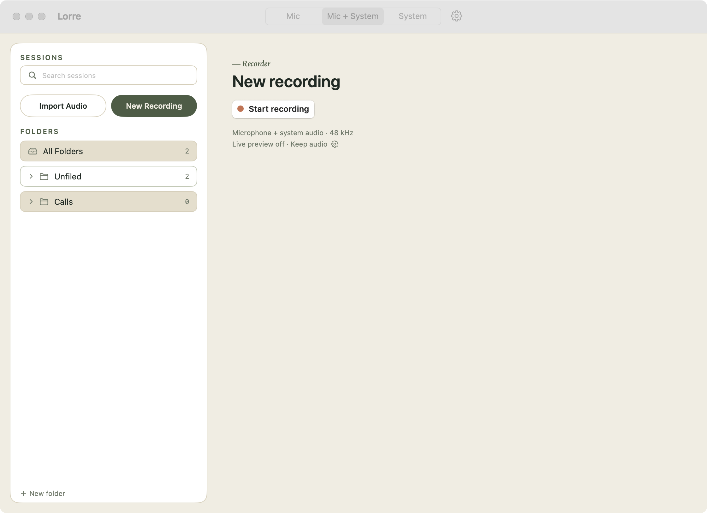

# Lorre

Lorre is a macOS transcription workspace for capturing or importing audio, processing it locally, reviewing speaker-labeled transcript segments, and exporting the result in multiple formats.

## Key features

- Capture any conversation your way with `Microphone`, `System audio`, or `Microphone + system audio`.
- See live transcription as you record, including mixed mic + system audio sessions.
- Powered by `Parakeet TDT 0.6B v3`, a fast multilingual ASR model that runs on Apple's `Neural Engine` and automatically transcribes `25 European languages` right on your Mac.
- Supports automatic language detection across `25 European languages`, including Dutch, English, German, French, Spanish, and more.
- Built on `FluidAudio` for local speech recognition, voice activity detection, and speaker diarization.
- Keep your recordings and transcripts on your Mac for a private local workflow.
- Enable `Privacy Mode` to automatically delete source audio after the transcript is saved.
- Import existing audio files and run them through the same transcription pipeline.
- Review transcripts with speaker labels, playback, speaker reassignment, and inline text editing.
- Export finished sessions as `Markdown`, `plain text`, or `JSON`.

## What is FluidAudio?

[`FluidAudio`](https://github.com/FluidInference/FluidAudio) is the on-device speech engine behind Lorre. It is a Swift library for Apple devices that combines speech-to-text, voice activity detection, and speaker diarization in one local pipeline.

Lorre uses FluidAudio's `Parakeet TDT 0.6B v3` model for final transcription. In simple terms, Parakeet is the ASR model that listens to your recording and turns spoken words into text. It supports automatic language detection across 25 European languages, while Lorre can use FluidAudio's faster streaming models to show a live preview while you are still recording.

`ANE-optimized` means FluidAudio is tuned to run efficiently on Apple's Neural Engine, the part of Apple silicon designed for AI workloads. For a user, that usually means faster transcription, lower power use, and less pressure on the CPU and GPU.

`Parakeet 0.6B` means the model has about 600 million parameters. That is relatively compact compared with many modern AI models, which helps keep it practical for local use on a Mac without needing the kind of memory larger cloud-style models often expect.

The main benefit of FluidAudio is that it gives Lorre a complete local speech stack:

- your audio can stay on your Mac instead of being sent to a cloud API
- it is built for Apple devices, so it can take advantage of Apple hardware for speed and efficiency
- it handles the hard parts together: detecting speech, transcribing it, and separating speakers

That is what lets Lorre offer private, on-device transcription with speaker labeling in a single app.

## Requirements

- macOS 15 or later
- Microphone access for microphone recording
- Audio Capture access for system-audio recording (separate from microphone — requested via `NSAudioCaptureUsageDescription`)
- A local build environment for Swift if you want to run from source

## Known limitation

When recording `Microphone + system audio` on a MacBook's built-in speakers and built-in mic, audio playing through the speakers is also picked up acoustically by the microphone — so the mix contains the system audio twice (once cleanly via the tap, once via the mic) and you hear an echo on playback. Transcription quality is unaffected and the realistic meeting case (Teams, Zoom, FaceTime, Discord active) is unaffected because those apps enable system-wide acoustic echo cancellation. Workaround for the non-meeting case: use headphones/AirPods or an external mic.

## Build and run

```bash
swift run
```

To build the app bundle in `dist/`:

```bash
./scripts/package_macos_app.sh
```

## Command line

The app binary doubles as a headless CLI. Inside the bundle:

```bash
/Applications/Lorre.app/Contents/MacOS/Lorre transcribe <file> [options]
```

- Accepts audio or video (`mp4`/`mov`/`m4a`/`wav`/`mp3` …); video audio tracks are extracted automatically.
- `--out <path>` / `-o` writes to a file (default: stdout). `--format md|json|both` (`both` requires `--out`, treated as a path stem so it writes `<stem>.md` and `<stem>.json`).
- `--register` persists the file as a real Lorre session **and** writes the Markdown + JSON auto-export envelope to the configured folder (or `--export-dir <path>`), so the downstream ingest pipeline picks it up.
- `--language <code>`, `--no-diarization`, `--speakers <n>`, `--quiet` mirror the in-app settings.

Running with no subcommand launches the normal GUI app.

## Privacy and local data

Lorre stores session data in `~/Library/Application Support/Lorre/`.

Each session is kept in its own folder and can contain:

- `session.json` for session metadata
- `transcript.json` for transcript data
- recorded or imported audio
- optional microphone and system-audio stem files for mixed recordings
- exported transcript files

If privacy mode is enabled before a recording or import, Lorre deletes the source audio after transcription completes and keeps the transcript and exports.

## Export formats

- Markdown
- Plain text
- JSON



<p align="center">
  <a href="https://fluidinference.com">
    
  </a>
</p>
